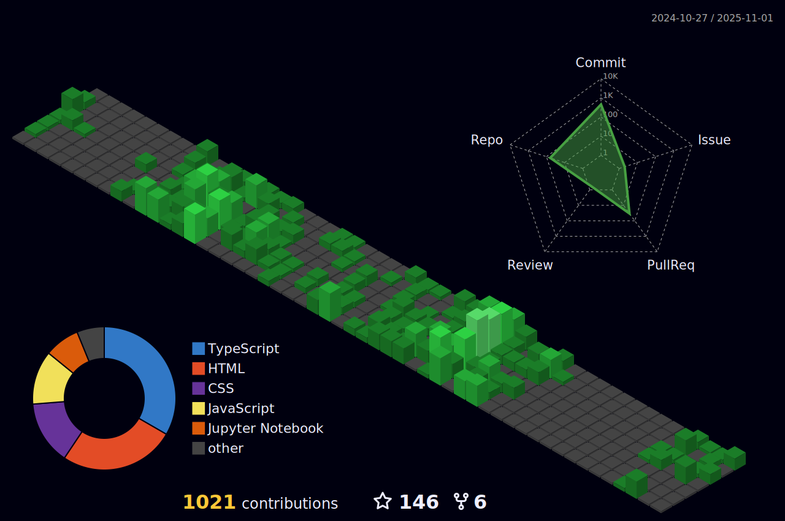

Hi My name is Aayush Adhikari
 =======================================================================================================================================

 Web Developer and Data Science Enthusiast
 -----------------------------------------

 * 🌍  I'm based in Nepal
 * ✉️  You can contact me at [adhikariaayush37@gmail.com](mailto:adhikariaayush37@gmail.com)

 ### Socials

 
 <a href="https://www.github.com/Aayush518" target="_blank" rel="noreferrer"> <picture> <source media="(prefers-color-scheme: dark)" srcset="https://raw.githubusercontent.com/danielcranney/readme-generator/main/public/icons/socials/github-dark.svg" /> <source media="(prefers-color-scheme: light)" srcset="https://raw.githubusercontent.com/danielcranney/readme-generator/main/public/icons/socials/github.svg" />  </picture> </a> <a href="https://www.linkedin.com/in/Aayush518" target="_blank" rel="noreferrer"> <picture> <source media="(prefers-color-scheme: dark)" srcset="https://raw.githubusercontent.com/danielcranney/readme-generator/main/public/icons/socials/linkedin-dark.svg" /> <source media="(prefers-color-scheme: light)" srcset="https://raw.githubusercontent.com/danielcranney/readme-generator/main/public/icons/socials/linkedin.svg" />  </picture> </a>

 <b>My GitHub Stats</b>

 

 <b>Note:</b> Top languages is only a metric of the languages my public code consists of and doesn't reflect experience or skill level.

   

 

 
