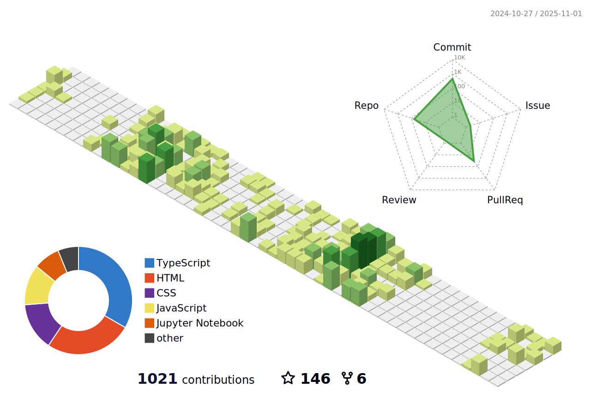

Hi My name is Aayush Adhikari
=======================================================================================================================================

Web Developer and Data Science Enthusiast
-----------------------------------------

I'm an enterprising Web Developer and avid AI Enthusiast. I'm deeply passionate about exploring the cutting-edge technologies of Machine Learning, Deep Learning, and Artificial Intelligence. Currently, I'm on an exhilarating journey, diving into the vast potential of the Solana blockchain and honing my expertise in Node.js to craft captivating web experiences. Beyond my coding skills, I possess a keen eye for captivating visual designs, utilizing tools like Adobe Illustrator and Figma. I strive to create seamless and visually enchanting interfaces that seamlessly merge form and function.

* 🌍  I'm based in Nepal
* ✉️  You can contact me at [adhikariaayush37@gmail.com](mailto:adhikariaayush37@gmail.com)

### Skills

### Socials

 <a href="https://www.github.com/Aayush518" target="_blank" rel="noreferrer"> <picture> <source media="(prefers-color-scheme: dark)" srcset="https://raw.githubusercontent.com/danielcranney/readme-generator/main/public/icons/socials/github-dark.svg" /> <source media="(prefers-color-scheme: light)" srcset="https://raw.githubusercontent.com/danielcranney/readme-generator/main/public/icons/socials/github.svg" />  </picture> </a> <a href="https://www.linkedin.com/in/Aayush518" target="_blank" rel="noreferrer"> <picture> <source media="(prefers-color-scheme: dark)" srcset="https://raw.githubusercontent.com/danielcranney/readme-generator/main/public/icons/socials/linkedin-dark.svg" /> <source media="(prefers-color-scheme: light)" srcset="https://raw.githubusercontent.com/danielcranney/readme-generator/main/public/icons/socials/linkedin.svg" />  </picture> </a>

<b>My GitHub Stats</b>

